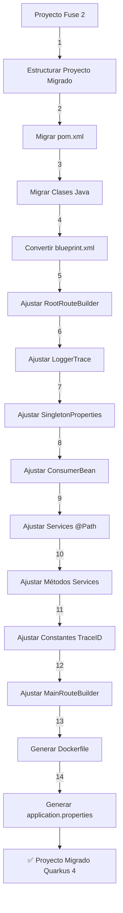

# 🛠️ Migrador de Proyectos Fuse 2 a Quarkus 4

Este repositorio contiene un conjunto de scripts Python para automatizar la migración de proyectos Java basados en Apache Camel 2 (Fuse 2) hacia una arquitectura moderna con Quarkus 4 y Camel 4.

---

## 📦 Estructura General del Proceso

El sistema permite:

1. **Migrar un proyecto individual (`migrar_proyecto_completo.py`)**
2. **Migrar todos los proyectos dentro de una carpeta (`migrar_todos_los_proyectos.py`)**

---

## ▶️ Requisitos Previos

- Python 3.8+
- Estructura de proyectos Java válida (incluyendo `pom.xml`, `src/main/java`, `blueprint.xml`, etc.)
- Plantilla de `pom.xml` adaptada para Quarkus 4
- Archivo `application-global.properties` de Fuse 2

---

## 📁 Para Migrar Todos los Proyectos

Ejecuta el siguiente comando:

```bash
python migrar_todos_los_proyectos.py <carpeta_IN> <carpeta_OUT> <ruta_pom_template.xml> <ruta_application-global.properties>
```

### 🔹 Parámetros:
- `<carpeta_IN>`: Ruta a la carpeta que contiene todos los proyectos originales a migrar.
- `<carpeta_OUT>`: Ruta donde se generarán los proyectos migrados.
- `<ruta_pom_template.xml>`: Ruta al archivo `pom.xml` base ya adaptado para Quarkus 4.
- `<ruta_application-global.properties>`: Ruta al archivo `.properties` global de Fuse 2, desde donde se extraerán variables relevantes.

📌 **Ejemplo:**

```bash
python migrar_todos_los_proyectos.py ./IN ./OUT ./pom_template.xml ./application-global.properties
```

---

## 🧱 Módulos Ejecutados

El proceso completo aplica automáticamente los siguientes módulos:

1. `estructurar_proyecto_migrado.py`
2. `migrar_pom.py`
3. `migrar_clases_completas.py`
4. `convertir_blueprint.py`
5. `ajustar_root_routebuilder.py`
6. `ajustar_logger_trace.py`
7. `ajustar_singleton_properties.py`
8. `ajustar_consumerbean.py`
9. `ajustar_services_path.py`
10. `ajustar_anotaciones_metodos_service.py`
11. `ajustar_constantes_trace_id.py`
12. `ajustar_main_routebuilder.py`
13. `generar_dockerfile.py`
14. `ajustar_application_properties.py`

---

## 📈 Diagrama de Flujo del Proceso



---

## 📝 Licencia

MIT
